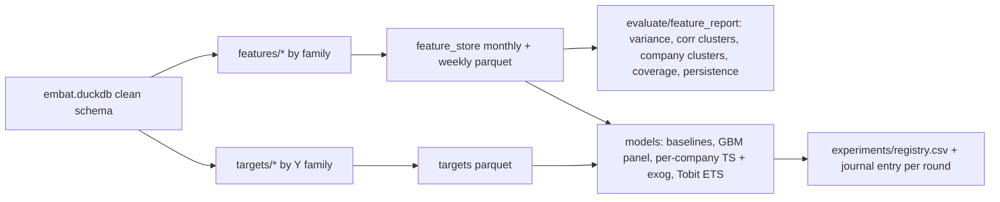

# 2026-09-18-2350 — Feature store + Y catalogue + model bake-off (handoff plan)

- **Author:** agent (Cursor, Claude), approved by Walter
- **When:** 2026-09-18 23:50 CEST
- **For:** the next executing agent (Grok). Read this file top to bottom, then `analysis/README.md`, then `analysis/score_pipeline.py`.

## Handoff state (facts, may rot)

- Git: private `main` = `900223b`, even with `origin/main`. Last two commits: Javier `9305e42` (clean schema, Python pipeline, validation findings), agent `900223b` (overnight folder). Everything below supersedes the overnight folder.
- Nothing is running in the background. The 16h search, its watchdog and the agent ping were all killed at 23:24. `overnight/runs/deadline.txt` still exists; delete it with the folder.
- Local, untracked and large: `overnight/candidates` (1.4 GB, 2,050 CSVs), `overnight/runs`, `overnight/cache`. Safe to delete.
- Data: `data/*.csv` hydrated via git-lfs; `data/embat.duckdb` built by `python analysis/build_db.py` (~10 s, schemas `main` raw + `clean`). Python 3 with pandas 2.3, statsmodels 0.14.5, duckdb available. R not installed. Docker daemon down (do not touch runtime).
- Holdout split to keep: `overnight/splits/holdout_companies.csv` (72 companies / 15 groups, seed 20260918, group-aware).

## Decisions

1. Erase the overnight search. Its result (primary AUROC 0.86) is invalid: the Y (own-history cuts on `net` and `overdue_share`) and the score (percentiles of `net`, `coverage`, `overdue_share`, `inflow`) shared columns, so it measured 6-month level persistence, not health.
2. Rule for everything that follows: **Y is never built from the same columns as the X allowed for the model that predicts it** (cross-source or cross-horizon by construction), and a trivial single-feature baseline must not already explain the Y.
3. Base is Javier's pipeline (`analysis/build_db.py`, `clean_db.py`, `score_pipeline.py`), Python only, DuckDB for aggregation.
4. Monthly SARIMAX was tested tonight on 40 train companies (fit 21 months, forecast 3): every ARIMA/SARIMAX variant lost to the historical mean (median normalised MAE 0.58–0.94 vs 0.49); exogenous invoices-due made it worse. Only the weekly grid is worth retrying, always against naive baselines.

## Still unknown

- Whether any Y in the catalogue below clears the acceptance rule with a usable base rate.
- Whether per-group or per-cluster models beat a single global GBM.
- Whether Tobit ETS has an honest censored series here (line-of-credit drawn vs `granted` is the only candidate).
- What the organizers' hidden truth is; the brief's examples (45 -> 65, 82 -> 68) suggest a latent trajectory.

---

# The plan (verbatim from the approved Cursor plan)

## 0. Context this plan assumes

- Base is Javier's pipeline, not the overnight folder: `analysis/build_db.py` -> `data/embat.duckdb` with `main` (raw) and `clean` schemas; `analysis/score_pipeline.py` already computes 14 monthly signals (`runway, d_runway, neg_liq, coverage, net_margin, volatility, growth, concentration, fin_cost_r, debt_serv_r, ar_overdue, ap_overdue, delay_coll, delay_paid`) and reconstructs month-end liquidity backwards from the 2026-09-01 `balances` snapshot (`_liquidity`).
- Javier's validation facts (journal `2026-09-18-2210`): level signals persist 6 months (r 0.4-0.7), change signals do not; pillars are nearly uncorrelated; naive "inflow falls 40%" events are mean reversion (AUC < 0.5); 174 companies have zero inflow in the last 3 months.
- The overnight result (primary 0.86) is invalid: Y and score shared `net`/`overdue_share`, so it measured persistence. Rule going forward: **Y must never be built from the same columns as X for the model that predicts it** (cross-source or cross-horizon by construction).
- Python only (R not installed). DuckDB for aggregation, pandas for panel ops.

## 1. Erase and relayout

- Delete `overnight/` (compare.py, search_16h.py, watchdog.sh, README, gitkeeps) and the local 1.4 GB in `overnight/candidates`, `overnight/runs`, `overnight/cache`. Remove the `overnight/*` lines from `.gitignore`. Remove the "Overnight score bake-off" row from `AGENTS.md`.
- Keep one artifact: the group-aware holdout `overnight/splits/holdout_companies.csv` (72 companies / 15 groups, seed 20260918) -> move to `analysis/splits/holdout_companies.csv`. Whole `group_id` in or out, never fitted on.
- New layout under `analysis/`:
  - `features/` : one module per feature family, each returns a `company_id, period, <features>` frame; `build_feature_store.py` assembles monthly and weekly panels.
  - `targets/` : one module per Y family; `build_targets.py` assembles the Y panel.
  - `evaluate/` : `feature_report.py` (variance, correlation, clustering, coverage, persistence), `protocol.py` (splits, rolling origin, metrics, leakage checks).
  - `models/` : `baselines.py`, `gbm_panel.py`, `ts_per_company.py` (SARIMAX/ETS/Prophet), `tobit_ets.py` (optional, see 6), `run_experiment.py`.
  - `experiments/registry.csv` (committed): one row per run: date, X families, Y, model, split, metric values, coverage, notes.
  - Outputs (gitignored): `data/feature_store/{monthly,weekly}.parquet`, `data/feature_store/targets.parquet`, `data/feature_store/coverage.csv`, `data/feature_store/feature_dictionary.md` (this one committed).

## 2. Panel skeleton and coverage tracking (first deliverable)

- Two grids: `company x month` (2024-09 .. 2026-08, 24 months) and `company x ISO-week` (~104 weeks) for the time-series models. A company enters the grid at its first transaction month.
- `coverage.csv` regenerated on every build, reported in every experiment row:
  - per feature: % companies with any value, % company-months non-null;
  - per raw table: % rows consumed by at least one feature (target: all 8 tables used; today only transactions, invoices, balances, banking_products are used);
  - per company: number of tables that contribute (0-8).
- Company metadata joined once: `group_id`, group size, `erp`, `currency`, `country` (ISO-2 from clean), `created_at` age, number of banking products, number of debt products, banks count.

## 3. Feature families (X)

All computed with only data up to the period end. Use `clean` flags (`is_dup`, `is_extreme`, `product_known`) as inputs, not silently dropped.

- **A. Cash flow levels and shape** (transactions): op_in, op_out, net, by category group (reuse `CAT_MAP`); rolling 3/6/12 sums; inflow/outflow ratio; net margin; growth vs 3 and 12 months back (YoY needs month 13+, track coverage); share of `uncategorized`; pending vs booked share.
- **B. Liquidity and balance path** (balances + transactions, per product then per company): reconstructed month-end and week-end balance (extend `_liquidity`), min/mean balance in period, days/weeks below 0 and below 1 month of outflow, runway, d_runway, number of negative-balance episodes, balance volatility (sd / mean |out|). Literature: low/negative ending balance and NSF-type counts are the strongest distress indicators in cash-flow underwriting (FinRegLab 2025).
- **C. Operational regularity** (transactions): tx count, sd of inter-transaction gap (operational volatility, Perez-Salazar 2026), share of months with zero inflow, weekday/seasonal profile, salary/tax/social_security regularity (missed payroll or tax month = strong signal), last-transaction recency.
- **D. Counterparty structure** (transactions + invoices, shared IDs): customer HHI and top-1 share, supplier HHI, number of active customers, new vs lost counterparties per quarter, churn rate; intercompany flow share (counterparties that are other `COMP_*` in the same `group_id`, via products labelled `Other (customer-defined)`).
- **E. Receivables/payables behaviour** (invoices): AR/AP open amount, overdue share, amount-weighted delay, DSO/DPO proxies, share of invoices > 30 days late (Banque de France: only > 30 days moves PD), credit-note ratio, pending_amount / amount, FX exposure share (invoice currency != accounting currency), issuance volume trend.
- **F. Debt and financing** (debt_products, debt_schedule_config, transactions category `debt_repayment`, `fee`, `interest_charge`): outstanding/granted utilisation per type, line-of-credit utilisation, number of facilities, weighted rate, months to `next_payment_date`, scheduled installment estimate (granted/total_periods) vs observed debt_service, debt service / inflow, fin cost / inflow, `outstanding_gt_granted` flag, new facility opened (created_at) in period, factoring/confirming presence.
- **G. Product mix and access** (banking_products): number of accounts, banks, product types, card/tpv presence, `created_after_snapshot`, custom vs bank-linked share.
- **H. Group context** (groups, companies): group size, sibling aggregates (group-level A/B features excluding the company), company share of group inflow.

Start with A, B, E, F (already partially in `score_pipeline.py`), add C, D, G, H in later rounds. Every family module has a docstring with formulas; `feature_dictionary.md` is generated from those docstrings.

## 4. Feature evaluation battery (`evaluate/feature_report.py`)

Run on train companies only (holdout excluded), report per feature:

- **Variance**: near-zero variance filter (share of identical values), within-company vs between-company variance ratio (features that are almost all between-company are size/identity proxies).
- **Correlation**: Spearman matrix, hierarchical clustering of |rho| (cut at 0.8) -> one representative per cluster; VIF on the representatives; Spearman vs log size (inflow) to flag size proxies (|rho| > 0.85).
- **Persistence**: autocorrelation at lags 1, 3, 6 (Javier's t -> t+6 check generalised); change features that do not persist are candidates for smoothing or removal.
- **Company clustering**: k-means and HDBSCAN on standardised company-level profiles (median and slope per feature); silhouette, cluster sizes, and a test that clusters are not just size or group. Used to decide whether per-group or per-cluster models are worth it (section 6).
- **Coverage**: from section 2, side by side with the above.

Output: `analysis/outputs/feature_report.md` plus PNGs (corr heatmap, dendrogram, cluster projections).

## 5. Y catalogue (proxy targets)

Each Y module documents: definition, horizon h, source tables, base rate, which X families are forbidden for it, and the literature anchor. Base rate target 5-30% for binaries; avoid mean-reversion artefacts by requiring **sustained** windows (>= 3 consecutive months or 6-month aggregates), per Javier's finding.

- **Y1 Reconstruction / forecasting** (continuous): next-k weeks/months of net flow, inflow, and reconstructed balance path (k = 4, 8, 13 weeks; 1, 3, 6 months). Metrics MASE, sMAPE, pinball at q10/q50/q90. This is the "explain the time series" target and the natural target for SARIMAX/ETS/Prophet/Tobit.
- **Y2 Liquidity stress**: balance below 0 (or below 0.5 month of outflow) for >= 2 of the next 3 months; runway < 1 month sustained; first negative-balance episode after >= 6 clean months (onset variant). Forbidden X: family B for the same window (use A, C, D, E, F).
- **Y3 Recovery**: from a stressed state at t, return to runway >= 3 months and no overdue > 30 days sustained for 3 months within h = 6. Both directions matter for the brief (45 -> 65 example).
- **Y4 Debt pressure**: debt service / inflow rises above 0.5 (or doubles) sustained over 3 months; new facility opened within 6 months after a liquidity dip (distress borrowing); line-of-credit utilisation > 90%; `outstanding_gt_granted` appearing. Forbidden X: family F.
- **Y5 Payment behaviour**: AP overdue share > 30 days rising above own-history p80 for 3 months; AR overdue > 30 days sustained (customer contagion); amount-weighted AP delay increase > 15 days vs trailing 6 months. Anchors: Hirshleifer et al. 2019 (PastDue% top vs bottom quintile doubles 6-month bankruptcy odds), Banque de France (> 30 days late, +40% PD). Forbidden X: family E.
- **Y6 Activity / going-concern**: inflow falls to 0 for 3 consecutive months after activity; last transaction > 60 days before snapshot; missed payroll/tax month. Forbidden X: family A/C same window.
- **Y7 Concentration shock**: loss of the top customer (top-1 counterparty share drops to 0 next quarter) followed by inflow drop > 25% sustained. Forbidden X: family D.
- **Y8 Cross-source composite**: cash-side pillar at t predicting invoice-side pillar at t+6 and vice versa (Javier's proposal); a Y is only accepted if a trivial single-feature baseline does not already explain it.

Acceptance rule for a Y before any model: base rate in range, not explained by log size (AUROC of size alone < 0.6), and not the same column as any allowed X. Keep adding Ys in later rounds; each new Y gets one literature search and a journal line.

## 6. Models

- **Baselines (mandatory in every experiment)**: last value, historical mean, seasonal naive (12 months / 52 weeks), single best feature percentile, Javier's current score.
- **Global panel GBM** (LightGBM and XGBoost): one model over all company-periods with lagged features (1, 3, 6), company metadata, and group-fold CV; monotone constraints on economically signed features; SHAP for explainability (feeds goal 3). Primary model for Y2-Y8.
- **Per-company time-series with exogenous regressors** for Y1: weekly panel; SARIMAX (statsmodels), ETS, Prophet with regressors. Exogenous = known-in-advance series: scheduled debt installments from `debt_schedule_config`, invoices due by `due_date` (AR and AP), calendar (month-end, quarter tax months). Monthly SARIMAX already lost to the historical mean on 40 companies; the weekly grid is the only version worth trying, and each fit is compared to the naive baselines per company.
- **Per-group / per-cluster pooled models**: one GBM or one pooled SARIMAX per `group_id` (>= 5 companies) or per cluster from section 4; middle ground between global and per-company. Only kept if it beats the global model on holdout.
- **Tobit ETS** (Pedregal and Trapero 2024, arXiv 2409.05412): censored innovations state space. The only honest use here is series censored at a known level: line-of-credit drawn balance censored at `granted`, or reconstructed balance floored by an overdraft limit. No Python package exists (R `UComp` only); implement a minimal Tobit local-level filter or skip and record why. Low priority.
- Hyperparameter search: Optuna with a fixed time budget per (Y, model) pair, objective = holdout-free CV metric; log every trial to the registry.

## 7. Evaluation protocol (`evaluate/protocol.py`)

- Company split: frozen group-aware holdout (72 companies) never used to fit anything, including percentile references. Group-fold CV (5 folds by `group_id`) on the rest.
- Time split: rolling origin; train on periods <= t, predict t+h, for t over the last 9 months. Report by horizon.
- Metrics: binaries AUROC, PR-AUC, Brier, lift@10%, lead time (months between first alert and event); continuous MASE, sMAPE, pinball; all with bootstrap CI over companies.
- Coverage next to every metric: % of holdout company-periods that received a prediction.
- Leakage checklist executed by code: Y columns not in X; no feature uses data after period end; no percentile reference fitted with holdout companies; group siblings on the same side of the split.

## 8. Iteration loop for Grok

Round = pick 1-2 feature families to add or refine, rebuild store, run feature report, run all accepted Ys x {baselines, GBM}, plus Y1 x TS models on a company sample, append registry rows, write a journal entry (`.agents/persistent-memory/YYYY-MM-DD-HHmm-round-N.md`: features added, coverage delta, best model per Y, what failed). Rounds in order: R1 = A+B+E+F + Y1/Y2/Y5 + baselines + GBM; R2 = C+D + Y3/Y4/Y6; R3 = G+H + Y7/Y8 + per-group models; R4 = TS exogenous models on weekly grid + Tobit decision; R5+ = literature-driven additions. Stop a direction when it fails to beat baselines twice in a row.

## 9. Literature anchors found tonight (starting points, verify while building)

- Yao, Levy-Chapira, Margaryan 2017, arXiv 1707.00757: checking-account activity beats financial ratios for corporate default; credit-line violations and cash inflows central.
- FinRegLab 2025, "Sharpening the Focus": bank-statement variables (credits, withdrawals, balance level and sd, low/negative ending balances, NSF counts, daily-pay loans) predictive of SMB default, more so for young firms.
- Hirshleifer, Li, Lourie, Ruchti 2019, NBER w25553: past-due % of trade credit predicts 6-month default, effect stronger for low-liquidity firms.
- Banque de France Bulletin 227/8: late customer payments > 30 days raise PD ~40%; <= 30 days no effect; DSO growth alone not predictive.
- Perez-Salazar, Marquez, Vidal-Silva 2026 (Computers 15:135): operational volatility (sd of inter-transaction time) and supplier HHI beat revenue level for micro-enterprise solvency.
- Pedregal and Trapero 2024 (arXiv 2409.05412) and 2025 (IJPR): Tobit ETS for censored series with known censoring level.
- Ng et al. 2025, arXiv 2510.16066: WOE/IV feature screening on bank-statement features for MSME scoring (IV >= 0.5 = suspect leakage; adopt this as a leakage smell test).

## 10. Not in scope / do not do

- No 0-100 formula here (that stays in `product/score/`); this plan produces X, Y, evidence, and a ranked list of models.
- No fitting on holdout, no Y built from the score, no PCA/PLS as target, no leaderboard chasing.
- No Docker/runtime decisions.

## 11. Working rules for the executing agent

- Commit per round with a plain message; pull --rebase before push (Javier commits in parallel).
- New journal file per round; never rewrite this one or older ones.
- `AGENTS.md` stays a pointer file: only swap the "Overnight score bake-off" row for a row pointing at `analysis/README.md` (feature store section).
- Keep scratch scripts in `/tmp`, not in the repo.
