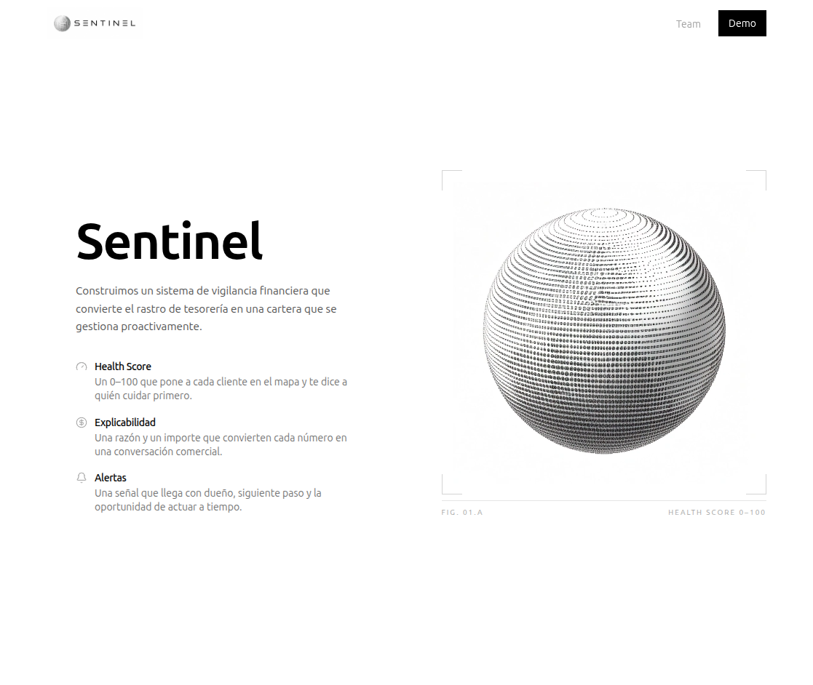
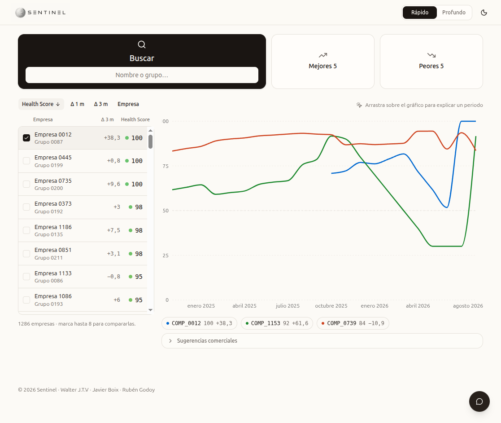
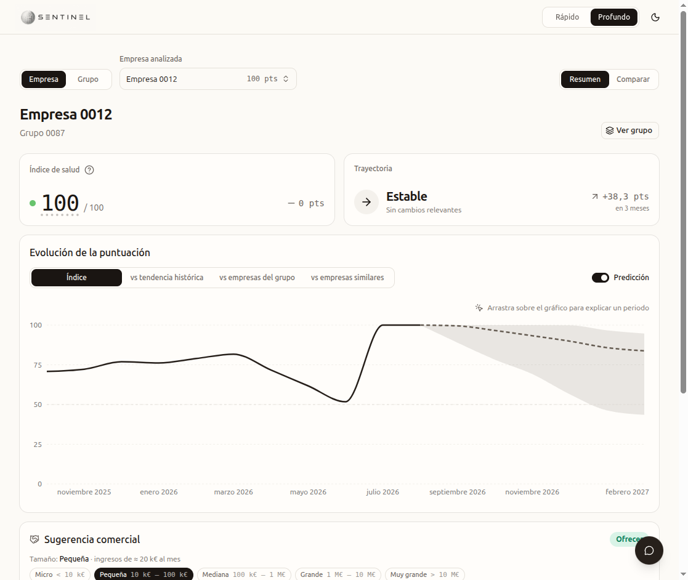
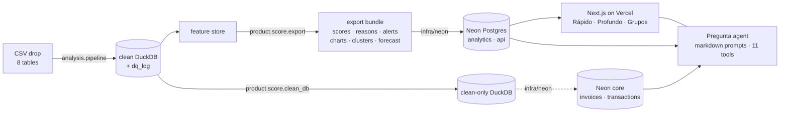

<div align="center">

<a href="https://hack-spain.vercel.app"></a>

# Health Sentinel

**A FICO-like health index for companies, built only from their treasury trail. Explained in euros, monitored monthly, questioned in plain Spanish.**

[**Live demo**](https://hack-spain.vercel.app) · [Method](product/score/METHOD.md) · [Data contract](product/score/DATA_CONTRACT.md) · [Monitor evaluation](analysis/monitor/evaluation.md) · [Agent prompts](product/web/src/lib/agent/prompts/prompt_map.md)


</div>

---

Track question: *¿Puede el dinero decir cómo está una empresa?* Our answer: yes, if you say **what** moved, **by how much in euros**, and **who should act**, and you stop short of promising what happens next.

<p align="center"></p>

**In numbers.** 1,286 companies · 250 groups · 24 months · 2.6 M bank movements · 0.9 M invoices → one 0–100 index per company-month, 17 items in 5 FICO categories, a trajectory state, top-4 reasons with the € behind each, 5 alert kinds with an owner and an action, 4 control-chart comparisons, a 6-month forecast fan, and a chat that only speaks from tool results. The whole run is one batch; the app reads Postgres.

<details>
<summary><b>Contents</b></summary>

- [What it actually says](#what-it-actually-says)
- [What you get](#what-you-get) · [Two minutes in the demo](#two-minutes-in-the-demo)
- [Why Embat](#why-embat)
- [The score in one screen](#the-score-in-one-screen)
- [The monitor](#the-monitor) · [What was measured](#what-was-measured)
- [Pregunta: the agent](#pregunta-the-agent)
- [What we do not claim](#what-we-do-not-claim)
- [Architecture](#architecture)
- [Run it](#run-it)
- [Repository map](#repository-map)
- [Team](#team)

</details>

## What it actually says

Reasons for a real company in the sample bundle (`COMP_0011`, August 2026, score 72.6, trajectory *dip*, confidence *medium*):

> −8.5 pts · Las entradas de caja se hundieron hasta el 6 % del nivel anterior de la propia empresa (31 k€ al mes frente a 566 k€): la puntuación baja como máximo 10 puntos al mes hacia 50 y ahora está limitada a 73 (sin la salvaguarda sería 81).
> −5.2 pts · De media en los últimos 3 cierres de mes, la caja cubrió 0,1 meses de salidas (42 k€ ahora; 288 k€ de salidas al mes).
> −4.7 pts · Las salidas mensuales oscilan un 198 % de su media en 6 meses (desviación típica 572 k€).
> −2.8 pts · De media en los últimos 3 cierres de mes, el 25 % de los cobros pendientes de clientes llevaba más de 30 días vencido (847 € ahora).

An alert, as the treasurer receives it (`alerts.json`, July 2026):

> **La puntuación se deteriora frente a su propio histórico** · `act` · tesorero
> Puntuación 50 frente a una habitual de 81 (−20 puntos), fuera de su rango normal en 3 de los últimos 4 meses. Las entradas de caja se hundieron hasta el 3 % del nivel anterior de la propia empresa (32 k€ al mes frente a 938 k€): la puntuación se limita a 50 (sin el límite sería 58).
> **Acción:** la actividad ha caído de golpe: confirma que las conexiones bancarias están completas y después contacta con la empresa.

Every number above is computed; the text is a template filled by the server, and the chat agent quotes these sentences rather than paraphrasing them.

## What you get

The four goals of the track, each with a deliverable you can run or open:

| Goal | Deliverable | Where |
|---|---|---|
| 1 · Signals from the treasury trail | One command: folder of CSVs → `clean` DuckDB + `dq_log` (every rule and every row it touched) → feature store. Same rules on unseen companies, nothing refitted | [`analysis/`](analysis/README.md) |
| 2 · Health index 0–100 | Percentile scorecard, five FICO categories, weights fixed a priori, monthly and as-of. `score_new(csv_folder)` scores companies it has never seen | [`product/score/`](product/score/README.md) |
| 3 · Explainability | Contributions that sum to the score, attribution that sums to the change, top-4 Spanish reasons with the € behind each, alerts with owner and action, control charts, forecast fan | [`product/score/explain.py`](product/score/explain.py), [`analysis/monitor/`](analysis/monitor/README.md) |
| 4 · Web + LLM | Health Sentinel on Vercel over Neon Postgres, with the Pregunta agent on every screen | [`product/web/`](product/web/README.md) |

### Two minutes in the demo

1. **Rápido** ([hack-spain.vercel.app/empresa](https://hack-spain.vercel.app/empresa)): pick *Peores 5*, tick up to eight companies, sort by Δ 3 m. Drag a period on the chart and the chat opens with that period's question.
2. **Profundo → Resumen**: index, trajectory, evolution with the fan, *Vigilancia* (the last three months in three cards), *Sugerencia comercial* (a posture, Ofrecer / Selectivo / Prudente / No ofrecer, and the products that fit; rules live in one config file, [`config/offers.ts`](product/web/src/config/offers.ts)), and the alerts with owner and action.
3. **Profundo → Grupo**: group mean against its own history, funnel against other groups, members ranked.
4. **Pregunta** (the floating button): "¿Qué cambió este mes?", "¿Por qué bajó en marzo?", "Ranking de mis empresas en barras con la media del grupo", "¿Qué facturas del cliente principal siguen sin cobrar?". Every answer shows the tools it called.

## Why Embat

Embat already holds every input this needs: bank movements from 15,000+ institutions, ERP invoices, balances and debt, entity-scoped, for 300+ mid-market groups. Health Sentinel is a premium module and a TellMe skill on data Embat already has: the score is free and becomes a habit, the alerts with owner and action, the Vigilancia posts, the peer and group charts and the chat are the paid layer, priced per monitored legal entity. Holdings with many subsidiaries and PE ops teams get a ranked portfolio; banks can receive, with the company's consent, the derived layer (score, trajectory, alert onsets) as an early-warning feed and a source of consented offers, never raw records and never a credit decision. Buyer rationale and pricing: [`.agents/persistent-memory/2026-09-20-0945-monetization-strategy.md`](.agents/persistent-memory/2026-09-20-0945-monetization-strategy.md).

## The score in one screen

<p align="center"></p>

Categories mirror FICO so a finance audience can place every item. Weights were fixed before any evaluation; the only fitted object is a 501-quantile percentile reference per item, computed on train companies only.

| Category | Weight | Items (equal weight inside) |
|---|---:|---|
| Payment history | 35 | Days suppliers are paid late · days customers pay late · payables > 30 d overdue · receivables > 30 d overdue |
| Amounts owed and liquidity | 30 | Runway (cash / monthly outflows) · negative month-ends · times cash turned negative · debt service / inflows · fees + interest / inflows |
| Length and stability | 15 | Months of history · months with money coming in · outflow volatility |
| New credit | 10 → 5 | Debt service and fees rising vs 6 months earlier. Thin in this data, so shrunk and redistributed, and the app says so |
| Customer mix | 10 | Dependence on one customer (HHI tail) · credit notes / billing |

Three rules that matter in practice: **missing data is reweighted, not faked** (a `confidence` flag says why); **going dark scores low, never high** (no booking for 60 days → cap 30, gliding 10 points a month so a data gap is not a cliff); **every reason carries money**.

## The monitor

Levels are traits (size, business model). What needs attention is **change**, so every chart is within-company: baseline = median of the 12 months ending 3 months earlier, scale = MAD with a floor, EWMA (λ 0.3, 3σ) and CUSUM (k 0.5, h 4), and a signal only counts if it holds **3 of the last 4 months**. Only the onset of a run alerts.

| Alert | Trigger | Owner and action |
|---|---|---|
| `score_deterioration` / `score_improvement` | Persistent, material move (≥ 8 points from own baseline); `act` at 20+, `watch` at 12+ | Item that moved most → tesorero (payables, cash), Cobros (receivables), CFO (debt, fees) |
| `category_drop` | A category falls ≥ 10 points with no score alert covering it | Same routing |
| `going_dark` | First month with no bank booking for 60 days; always `act` | Tesorero: check the connection or the company |
| `top_customer_quiet` | Last quarter's top customer got no invoice this month | Cobros: review exposure and collections. Never "revenue at risk" |

Four comparisons share the machinery: the company against its own history, against its behaviour **cluster** (peers, not segments), the group against its own history, and the group against other groups (funnel limits; none under 3 scored members). Improvements alert too.

**Forecast.** A pooled quantile regression on the company's own deviation, level, recent moves and volatility gives a fan with 50 % and 80 % bands, 1–6 months ahead. Trend models lose to the last value on this score, so none is used.

### What was measured

Train companies only, holdout untouched. Numbers in [`analysis/monitor/evaluation.md`](analysis/monitor/evaluation.md) and [`forecast_evaluation.md`](analysis/monitor/forecast_evaluation.md).

| | Result |
|---|---|
| Top customer quiet | **56 %** of flagged company-months lose the customer vs **29 %** base (lift 1.9, 95 % CI 48–63 %). The one alert with measured lift. A shallow model only ranks these alerts; never shown as a probability |
| Alert volume | **0.53** risk and **0.22** improvement alerts per company-year. 41 % of one-month falls of 8+ points became an alert within three months; the rest reverted, which is what persistence is for |
| Forecast fan | Pinball loss vs the naive fan: **+4.4 %** at 1 month to **+13.1 %** at 6; 50 % / 80 % bands cover 50 % / 80 % on held-out companies (74–77 % when the later months are held out too) |
| Group funnel | 1.6 % of train group-months outside 3σ, 0.06 % persistently |

## Pregunta: the agent

The floating chat on every screen. It is the same agent in Rápido, Profundo and Grupos, and dragging a period on any chart opens it with that period's question.

- **Prompts are files, not strings.** A stack of markdown layers (`prompt_map.md` first, conflict order SCOPE > WORDING > TOOLS > PRODUCT > RECORDS) assembled at runtime by `prompt-loader.ts`. Alert copy is the Spanish production text; the model never invents English.
- **Grounded tools.** `get_company`, `explain_change`, `get_group`, `get_alerts`, `get_control_chart`, `compare_with_cluster`, `get_forecast` read the current score run in Neon (`api` / `analytics`); a score is never recomputed. `query_clean_db` runs one guarded `SELECT … LIMIT 200` over the cleaned records (`core`) when the question is about invoices, movements or balances.
- **Charts the server fills.** The model chooses what to plot, never the values.
- **Per-turn caps** on tool calls and a forced text step, so a parallel burst of reads still ends in an answer.
- **Vigilancia** (the last three months of a company or group) is built deterministically by `watcher-post.ts` from the five monitor rules and precomputed; the LLM only answers replies.

## What we do not claim

- The claim is **explainable and monitorable**, not predictive: the score says what moved, by how much and in whose hands it lands. Validation numbers in [`product/score/validation.md`](product/score/validation.md).
- The forecast is a **persistence fan**, not a prediction of outcomes.
- The holdout was looked at once, at the end, and used for no choice. Nothing here says anything about the hidden test.

## Architecture



Two immutable artifacts feed a load: the **export bundle** (static JSON, contract in `DATA_CONTRACT.md`, a 12-company sample in `product/score/sample_bundle/`) and the **clean-only DuckDB**. A new CSV drop is a new bundle, a new DuckDB and a reload; the app reads `api.current_run`, never files. Credentials stay server-only (`DATABASE_URL`, never `NEXT_PUBLIC_`).

## Run it

Python 3.12 with `duckdb pandas pyarrow scipy scikit-learn lightgbm`. Set `PYTHONUTF8=1` and run from the repo root with `PYTHONPATH=.`.

```bash
# 1. Data (not in git): the track zip → data/
curl -L -o data/raw/output_hackspain_data.zip \
  https://f5xe6kyx7jpysotw.public.blob.vercel-storage.com/output_hackspain_data.zip
unzip -n data/raw/output_hackspain_data.zip -d data/raw

# 2. Clean + feature store from any CSV folder (~20 s on the full data)
python -m analysis.pipeline --input data/raw/output --work-dir data/bundle_work

# 3. Score unseen companies: scores.csv + scores_detail.parquet
python -m product.score.run --csv-folder data/raw/output --out out/

# 4. Export the bundle the app loads (scores, reasons, alerts, charts, forecast)
python -m product.score.export --csv-folder data/raw/output --out data/bundle
python -m product.score.clean_db --work-dir data/bundle_work --out data/embat_clean.duckdb

# 5. Load Neon (schema, transform, load, validate): infra/neon/README.md
python3 infra/neon/scripts/transform_bundle.py
node infra/neon/scripts/load_http.mjs --analytics-only

# 6. Web app
cd product/web && pnpm install && cp .env.example .env.local   # DATABASE_URL, HELMCODE_API_KEY
pnpm dev
```

Refit steps are deliberate, not part of a run: `python -m product.score.fit` (percentile reference), `python -m analysis.monitor.fit` (clusters, floors, group variance), `python -m analysis.monitor.forecast` (fan parameters). Tests and checks: `python -m product.score.guard_test`, `python -m product.score.validate`, `python -m analysis.pipeline_check`, `python -m analysis.monitor.evaluate`.

Inspect a bundle without the app: `python product/score/inspector/serve.py --bundle product/score/sample_bundle --open` re-checks the arithmetic (contributions + guard = score, item deltas = change) and the sha256 of every company file in the browser.

## Repository map

| Path | What |
|---|---|
| [`AGENTS.md`](AGENTS.md) | Rules and pointers for the three teammates and their agents |
| [`.agents/`](.agents/README.md) | Dated journal of decisions; the index says which entries still bind |
| [`data/`](data/) | Track dump (gitignored) and the [field dictionary](data/data_dictionary.md) |
| [`analysis/`](analysis/) | Cleaning (`build_db.py`, `clean_db.py`), pipeline, feature store, [monitor](analysis/monitor/README.md) |
| [`product/score/`](product/score/) | Scorecard, explain, `score_new`, validation, export, [METHOD.md](product/score/METHOD.md), [DATA_CONTRACT.md](product/score/DATA_CONTRACT.md), inspector, sample bundle |
| [`product/web/`](product/web/) | Health Sentinel (Next.js 16, React 19, Tailwind 4, shadcn, recharts, AI SDK) and the agent |
| [`infra/neon/`](infra/neon/) | Schemas, transform, load, validation for Neon Postgres |
| [`poc/`](poc/) | Frozen Streamlit proof of concept, kept for the record |
| [`overnight/`](overnight/) | Closed night harness that did the feature and outcome discovery |

## Team

Built for **HackSpain 2026**, track **X Ray by Embat**, by [Rubén Godoy](https://github.com/rubengpr) (CEO), [Walter J.T.V](https://ezwalt.github.io/) (CTO) and [Javier Boix](https://jboixcampos.github.io) (CSO).

Brief: [X Ray challenge](https://claude.ai/artifact/8N8Q7QMjprCUWxGAiJaWoP?sk=5wYke4E8ukAw6afs6TrG1g). Dataset: synthetic SME treasury, 2024-09 → 2026-09, 250 groups, 1,286 companies, ~2.6 M transactions, ~0.9 M invoices.

MIT, see [LICENSE](LICENSE). The organizer dataset is not covered by this license and is not in git.
