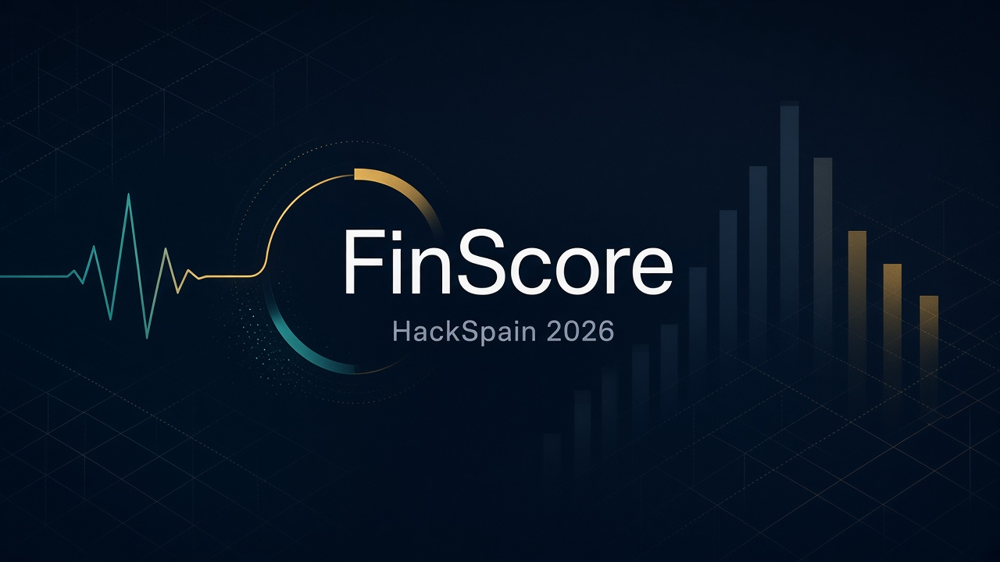

  

  <h1>Embat-FinScore</h1>

  
<strong>Private working repo · HackSpain 2026 · X Ray (Embat).</strong>

  

    <a href="AGENTS.md"><strong>AGENTS.md</strong></a>
    ·
    <a href=".agents/persistent-memory/2026-09-18-initial-context.md"><strong>Memory</strong></a>
    ·
    <a href="data/data_dictionary.md"><strong>Dictionary</strong></a>
    ·
    <a href="product/"><strong>Product</strong></a>
  

  

    
    
    
    
  

---

FICO-like **company health score**. Track question: *¿Puede el dinero decir cómo está una empresa?*

| # | Goal | Path |
|---|------|------|
| 1 | Signals from the treasury trail | [`analysis/`](analysis/) |
| 2 | Health index 0–100 (feature engineering + rationale) | [`product/score/`](product/score/) |
| 3 | Explainability | [`product/score/`](product/score/) |
| 4 | Webpage + LLM; the **company** is the user and gives the data | [`product/web/`](product/web/) |

Decisions live in [`.agents/persistent-memory/`](.agents/persistent-memory/). Nothing above is implemented yet.

| Path | What |
|------|------|
| [`AGENTS.md`](AGENTS.md) | Pointers for agents and the three teammates |
| [`data/`](data/) | Track dump + dictionary |
| [`analysis/`](analysis/) | Goal 1 (empty) |
| [`product/`](product/) | Goals 2–4 (empty). `Dockerfile` is empty |
| Public sibling | `eZWALT/Embat-FinScore` — publish at the end |

Brief: [X Ray artifact](https://claude.ai/artifact/8N8Q7QMjprCUWxGAiJaWoP?sk=5wYke4E8ukAw6afs6TrG1g).  
Dataset: [output_hackspain_data.zip](https://f5xe6kyx7jpysotw.public.blob.vercel-storage.com/output_hackspain_data.zip).

MIT — see [LICENSE](LICENSE). The organizer dataset is not this license and is not in git.
