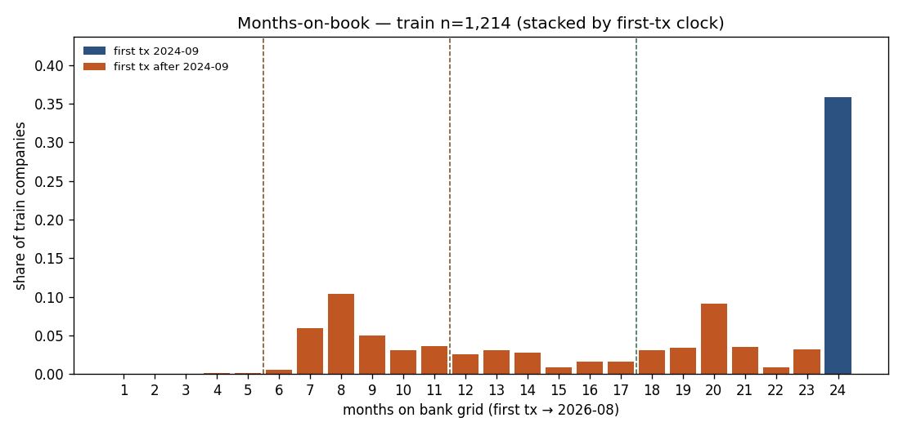

# Trail length — Q6 honesty (how many months earlier)

Generated `2026-09-19T01:52:36+02:00` by agent `6bf54618`. DuckDB `clean` read-only. `monthly.parquet` / `targets.parquet` read-only. Rates and cuts on **train**. Holdout 72 is coverage only. Fixed trail cuts 6 / 12 / 18 / 24 — not quantiles. No 0–100. No parquet rewrite. No new Y.

A lead-time claim is only as long as the observed trail (2024-09-01 → 2026-08-01, 24 official months). `created_at` is a **connection** clock; first transaction is the **bank-trail** clock. Using `created_at` as a health Y is **PARK** (onboarding ≠ health).

## Headline

- **Banking first `created_at` after 2024-09-01 (join-QA replica):** 891 / 1,211 train companies with a banking product = **73.6%**. Join QA quoted 891/1,211 = 73.6%. **CONFIRM** (count match=True, share within 0.5pp=True). No banking product: 3.
- **Stricter (first created *month* after 2024-09, i.e. ≥ 2024-10):** 859/1,211 = **70.9%**. September-2024 first connection: 32 (2.6%) — counted in the 73.6% because join QA used `created_at > 2024-09-01`, not `month > 2024-09`.
- **First debt `created_at` after 2024-09-01:** 285/358 = **79.6%**. Same connection clock; do not read as new leverage.
- **Bank trail (first tx month after 2024-09):** 779/1,214 = **64.2%**. This is the left-truncation that caps Q6, not the product clock.
- **Invoice book vs bank:** ever-ERP 744 (61.3%), dark 470. First issuance after 2024-09: 367 (49.3% of ERP). Invoice months can exceed the bank grid when issuance pre-dates first tx (pass 15: 43.5% of ever-ERP).
- **Months-on-book (official grid span):** <6 = 0.2% (3), <12 = 28.8% (350), ≥18 = 58.8% (714), =24 = 35.8% (435). Median 20 months; mean 17.4.
- **Holdout is missing full books, not a <12 pile:** 69/72 = 95.8% late first-tx; <12 = 26.4% (19) vs train 28.8%; ≥18 = 33.3% vs train 58.8%; =24 = 4.2% (3) vs train 35.8%. Median grid 15 vs 20. Hidden-test Q6 will not transfer (LOW_POWER + no 24-month pile).
- **Q6 lags (train labeled):** Y4 `d_cust_hhi_lag3` non-null on **35.8%** overall and **21.7%** of short (<12m so-far) rows — missing is shift + calendar `full6` + no ERP HHI, residual 0. Among those short Y4 rows that *have* the lag, honest≥6 is 66.2% (p50=6) vs 100% on long. Y7 `e_ar_issued_lag1` non-null on **97.2%** / **95.2%** short; the hole is only `so-far<2`. Y7's short-trail Q6 limit is *length* (honest≥6 = 47%, p50=5), not a missing lag. 43.5% of ever-ERP companies have invoices *before* first tx. Even among the 435 24-month train books, only **16.8%** (73) ever have a Y4 labeled row with HHI_lag3 (Y7: 59.5%, and every labeled 24m Y7 has the lag).
- **Y base rates short (<12 so-far) vs long (≥18 so-far), train labeled:** y3_recover 6.8% (n=3,723) vs 7.5% (n=213); y2_neg_2of3 7.9% (n=11,186) vs 6.2% (n=1,908); y7_top1_lost 30.2% (n=4,421) vs 22.8% (n=916); y4_ds_r_double 13.9% (n=1,334) vs 10.1% (n=297). None only-defined-on-long. Y3 long so-far is a Feb-2026 sliver of 2024-09 starters. Company-total (preferred): y3_recover 8.9% vs 6.9%; y2_neg_2of3 8.0% vs 7.3%; y7_top1_lost 22.2% vs 29.7%; y4_ds_r_double 13.4% vs 13.9%.
- **Holdout groups:** 12 / 15 first appear after 2024-09; 65 / 72 companies sit in those new groups; 0 train siblings. Hidden test is a late-arrival sample. Quote train CV for any lead-time claim. Holdout Y4 labeled with `d_cust_hhi_lag3`: 21 / 135 (short 18 / 88); only **2** of those 21 sit on the three 24-month holdout books. The 3-month HHI lead is almost undefined on the hidden 72.

### Months-on-book histogram (train companies)

| months | n | share |
| --- | --- | --- |
| 1 | 0 | 0.0% |
| 2 | 0 | 0.0% |
| 3 | 0 | 0.0% |
| 4 | 2 | 0.2% |
| 5 | 1 | 0.1% |
| 6 | 7 | 0.6% |
| 7 | 72 | 5.9% |
| 8 | 126 | 10.4% |
| 9 | 61 | 5.0% |
| 10 | 37 | 3.0% |
| 11 | 44 | 3.6% |
| 12 | 31 | 2.6% |
| 13 | 37 | 3.0% |
| 14 | 34 | 2.8% |
| 15 | 10 | 0.8% |
| 16 | 19 | 1.6% |
| 17 | 19 | 1.6% |
| 18 | 37 | 3.0% |
| 19 | 41 | 3.4% |
| 20 | 111 | 9.1% |
| 21 | 42 | 3.5% |
| 22 | 10 | 0.8% |
| 23 | 38 | 3.1% |
| 24 | 435 | 35.8% |

Fixed-cut buckets (not quantiles):

| bucket | months | n | share |
| --- | --- | --- | --- |
| <6 | 1–5 | 3 | 0.2% |
| 6-11 | 6–11 | 347 | 28.6% |
| 12-17 | 12–17 | 150 | 12.4% |
| 18-23 | 18–23 | 279 | 23.0% |
| 24 | 24–24 | 435 | 35.8% |

Holdout months-on-book (coverage only, same fixed cuts): <6 = 1.4% (1), <12 = 26.4% (19), ≥18 = 33.3% (24), =24 = 4.2% (3) of 72.

## Pass 1 — bank trail on the official monthly grid

A company enters `monthly_grid` at the month of its first transaction and stays through 2026-08-01. `n_grid_months` is that span (1–24). `n_tx_months` counts months with ≥1 transaction inside the same window (2024-09-01 ≤ date < 2026-09-01). September 2026 extract txs are off-grid.

| split | n_cos | late first tx | median grid | median tx-months | any gap | =24 |
| --- | --- | --- | --- | --- | --- | --- |
| train | 1,214 | 779 (64.2%) | 20 | 18 | 189 (15.6%) | 435 (35.8%) |
| holdout | 72 | 69 (95.8%) | 15 | 15 | 6 (8.3%) | 3 (4.2%) |

First transaction month (train):

| month | n |
| --- | --- |
| 2024-09 | 435 |
| 2024-10 | 38 |
| 2024-11 | 10 |
| 2024-12 | 42 |
| 2025-01 | 111 |
| 2025-02 | 41 |
| 2025-03 | 37 |
| 2025-04 | 19 |
| 2025-05 | 19 |
| 2025-06 | 10 |
| 2025-07 | 34 |
| 2025-08 | 37 |
| 2025-09 | 31 |
| 2025-10 | 44 |
| 2025-11 | 37 |
| 2025-12 | 61 |
| 2026-01 | 126 |
| 2026-02 | 72 |
| 2026-03 | 7 |
| 2026-04 | 1 |
| 2026-05 | 2 |

## Pass 2 — product `created_at` (confirm / correct 73.6%)

Join QA (`data_join_qa.md` Pass 4): of 1,211 train companies with a banking product, **891 (73.6%)** have `MIN(banking_products.created_at) > 2024-09-01`. Replica below uses the same denominator (train ∩ panel ∩ has banking product) and the same `>` cut. Timestamps in `clean` are naive; treating them as UTC does not move the date of any first-created (none land on 2024-09-01 00:00).

| split | with banking | no banking | first created > 2024-09-01 | first created month ≥ Oct-2024 | first created < 2024-09-01 | with debt | debt first created > 2024-09-01 |
| --- | --- | --- | --- | --- | --- | --- | --- |
| train | 1,211 | 3 | 891 (73.6%) | 859 (70.9%) | 320 (26.4%) | 358 | 285 (79.6%) |
| holdout | 72 | 0 | 70 (97.2%) | 70 (97.2%) | 2 (2.8%) | 20 | 20 (100.0%) |

**Connection clock ≠ bank trail (train, has banking, n=1,211):** late `created_at` & full 2024-09 tx start = 124; late `created_at` & late first tx = 767; early `created_at` & late first tx = 9; early `created_at` & 2024-09 tx = 311. `created_at` after first tx: 851 (70.3% of banking books) — the product row is a later *connection*, not the start of cash movement. `created_at` before first tx: 360 (29.7%) — product older than the 2024-09 tx window (left-truncated *observations*, not a new company).

**PARK:** do not turn `created_at` (company, banking, or debt) into a health Y. Onboarding / connection is not a 45→65 or 82→68 trajectory.

## Pass 3 — invoice book vs bank book

Ever-ERP = ≥1 book invoice (`document_type=invoice`, `status<>cancel`, `amount<>0`). The 470 are never-ERP on train (join QA confirmed). Invoice months below count any issuance month in 2024-09..2026-08 (can exceed the bank grid when invoices predate first tx — see pass 15). Bank months = official grid span.

| split | ever-ERP | never-ERP | first iss after 2024-09 | median inv months (ERP) | mean bank months (ERP) | mean bank months (dark) | ERP inv < bank months | first iss >31d after first tx |
| --- | --- | --- | --- | --- | --- | --- | --- | --- |
| train | 744 (61.3%) | 470 (38.7%) | 367 (49.3% of ERP) | 20.0 | 18.2 | 16.2 | 283 (38.0%) | 144 (19.4%) |
| holdout | 40 (55.6%) | 32 (44.4%) | 26 (65.0% of ERP) | 19.0 | 14.6 | 15.3 | 10 (25.0%) | 7 (17.5%) |

## Pass 5 — left-truncation: smaller? new group or new subsidiary?

Late = first transaction month after 2024-09. Size = company-median `log1p(a_in3)` on train company-months (descriptive; no fitted bins). New group = the group's earliest first-tx (all members, including holdout siblings for the group clock) is after 2024-09. New subsidiary = late company in a group that already had a 2024-09 starter.

Train late first-tx: **779 / 1,214 (64.2%)**. Of those: new subsidiaries **113 (14.5%)**, members of new groups **666 (85.5%)**. Train groups: 235 (old 92, new 143).

| slice | n | median log1p(a_in3) | mean | p25 | p75 |
| --- | --- | --- | --- | --- | --- |
| late first tx | 779 | 12.669 | 11.759 | 10.747 | 14.260 |
| first tx in 2024-09 | 435 | 12.493 | 11.416 | 10.694 | 13.908 |

Δ median log1p(a_in3) (late − full) = 0.176. Mann–Whitney two-sided p = 0.1045 (diagnostic, not a cut).

## Pass 6 — accepted Y base rates, short vs long trail (train)

Primary clock is **months-on-book so far** at the company-month (Q6-honest: a 24-month company is still short in its first months). Robustness: company total grid span. Short = <12, long = ≥18. Mid 12–17 shown. Y3 is stressed-only with a 6-month future window; Y7 needs a trailing 3-month AR book + 3-month future; Y4 needs ds_r at t and t+3. If a Y has no short-trail labels, that is a definition floor, not a sampling accident.

Bucket `24` is empty for every labeled Y: labels need future months, so the last grid month is never labeled. `so-far ≥ 18` for Y3 is almost only `2026-02` of the 435 companies that started in 2024-09 (Y3 horizon = 6, so last labeled period is 2026-02 = month 18). Short-vs-long *so-far* base rates for Y3 are partly a **calendar mix**, not a pure trail effect. Prefer the `*_company` rows for a base-rate comparison.

| Y | slice | n_labeled | n_pos | base | % of cm labeled |
| --- | --- | --- | --- | --- | --- |
| y3_recover | all_train | 5,648 | 402 | 7.1% | 26.7% |
| y3_recover | short_<12_sofar | 3,723 | 252 | 6.8% | 29.8% |
| y3_recover | mid_12_17_sofar | 1,712 | 134 | 7.8% | 36.1% |
| y3_recover | long_>=18_sofar | 213 | 16 | 7.5% | 5.4% |
| y3_recover | short_<12_company | 146 | 13 | 8.9% | 4.9% |
| y3_recover | long_>=18_company | 5,138 | 355 | 6.9% | 32.0% |
| y2_neg_2of3 | all_train | 17,356 | 1,271 | 7.3% | 82.0% |
| y2_neg_2of3 | short_<12_sofar | 11,186 | 885 | 7.9% | 89.7% |
| y2_neg_2of3 | mid_12_17_sofar | 4,262 | 267 | 6.3% | 89.9% |
| y2_neg_2of3 | long_>=18_sofar | 1,908 | 119 | 6.2% | 48.4% |
| y2_neg_2of3 | short_<12_company | 1,833 | 147 | 8.0% | 61.7% |
| y2_neg_2of3 | long_>=18_company | 13,897 | 1,021 | 7.3% | 86.4% |
| y7_top1_lost | all_train | 7,464 | 2,149 | 28.8% | 35.3% |
| y7_top1_lost | short_<12_sofar | 4,421 | 1,337 | 30.2% | 35.4% |
| y7_top1_lost | mid_12_17_sofar | 2,127 | 603 | 28.3% | 44.9% |
| y7_top1_lost | long_>=18_sofar | 916 | 209 | 22.8% | 23.2% |
| y7_top1_lost | short_<12_company | 774 | 172 | 22.2% | 26.1% |
| y7_top1_lost | long_>=18_company | 6,230 | 1,851 | 29.7% | 38.7% |
| y4_ds_r_double | all_train | 2,370 | 329 | 13.9% | 11.2% |
| y4_ds_r_double | short_<12_sofar | 1,334 | 185 | 13.9% | 10.7% |
| y4_ds_r_double | mid_12_17_sofar | 739 | 114 | 15.4% | 15.6% |
| y4_ds_r_double | long_>=18_sofar | 297 | 30 | 10.1% | 7.5% |
| y4_ds_r_double | short_<12_company | 142 | 19 | 13.4% | 4.8% |
| y4_ds_r_double | long_>=18_company | 2,059 | 287 | 13.9% | 12.8% |

Definition floors (train labeled):

| Y | min so-far | p50 so-far | min period | n labeled | share short | share long |
| --- | --- | --- | --- | --- | --- | --- |
| y3_recover | 2 | 9.0 | 2024-10-01 | 5,648 | 65.9% | 3.8% |
| y2_neg_2of3 | 1 | 8.0 | 2024-09-01 | 17,356 | 64.5% | 11.0% |
| y7_top1_lost | 1 | 10.0 | 2024-11-01 | 7,464 | 59.2% | 12.3% |
| y4_ds_r_double | 3 | 10.0 | 2024-11-01 | 2,370 | 56.3% | 12.5% |

Holdout labeled counts (LOW_POWER, no rates used as cuts):

| Y | slice | n_labeled | n_pos |
| --- | --- | --- | --- |
| y3_recover | all_holdout | 235 | 14 |
| y3_recover | short_<12_sofar | 188 | 14 |
| y3_recover | long_>=18_sofar | 2 | 0 |
| y2_neg_2of3 | all_holdout | 857 | 23 |
| y2_neg_2of3 | short_<12_sofar | 675 | 18 |
| y2_neg_2of3 | long_>=18_sofar | 13 | 0 |
| y7_top1_lost | all_holdout | 391 | 122 |
| y7_top1_lost | short_<12_sofar | 319 | 113 |
| y7_top1_lost | long_>=18_sofar | 12 | 0 |
| y4_ds_r_double | all_holdout | 135 | 16 |
| y4_ds_r_double | short_<12_sofar | 88 | 11 |
| y4_ds_r_double | long_>=18_sofar | 2 | 0 |

## Pass 7 — Q6 lag honesty (`d_cust_hhi_lag3`, `e_ar_issued_lag1`)

Y4 uses `d_cust_hhi_lag3` as the published single-feature clock. Y7 uses `e_ar_issued_lag1` as a lead. Both are **history**: HHI itself needs a 6-month invoice window (family D `full6`); lag-3 needs three further months on the panel. `e_ar_issued_lag1` is a 1-month shift of family E issuance (NaN before first invoice and on the 470). Share of **train labeled rows** where the lag is non-null, by so-far bucket.

| Y | bucket | n_labeled | HHI_lag3 nn | issued_lag1 nn |
| --- | --- | --- | --- | --- |
| y3_recover | <6 | 1,436 | 80 (5.6%) | 905 (63.0%) |
| y3_recover | 6-11 | 2,287 | 737 (32.2%) | 1,434 (62.7%) |
| y3_recover | 12-17 | 1,712 | 936 (54.7%) | 1,141 (66.6%) |
| y3_recover | 18-23 | 213 | 109 (51.2%) | 138 (64.8%) |
| y3_recover | 24 | 0 | 0 (—) | 0 (—) |
| y3_recover | short_<12 | 3,723 | 817 (21.9%) | 2,339 (62.8%) |
| y3_recover | long_>=18 | 213 | 109 (51.2%) | 138 (64.8%) |
| y3_recover | all | 5,648 | 1,862 (33.0%) | 3,618 (64.1%) |
| y2_neg_2of3 | <6 | 5,879 | 362 (6.2%) | 2,910 (49.5%) |
| y2_neg_2of3 | 6-11 | 5,307 | 1,757 (33.1%) | 3,402 (64.1%) |
| y2_neg_2of3 | 12-17 | 4,262 | 2,258 (53.0%) | 2,922 (68.6%) |
| y2_neg_2of3 | 18-23 | 1,908 | 995 (52.1%) | 1,305 (68.4%) |
| y2_neg_2of3 | 24 | 0 | 0 (—) | 0 (—) |
| y2_neg_2of3 | short_<12 | 11,186 | 2,119 (18.9%) | 6,312 (56.4%) |
| y2_neg_2of3 | long_>=18 | 1,908 | 995 (52.1%) | 1,305 (68.4%) |
| y2_neg_2of3 | all | 17,356 | 5,372 (31.0%) | 10,539 (60.7%) |
| y7_top1_lost | <6 | 1,983 | 344 (17.3%) | 1,772 (89.4%) |
| y7_top1_lost | 6-11 | 2,438 | 1,601 (65.7%) | 2,438 (100.0%) |
| y7_top1_lost | 12-17 | 2,127 | 1,993 (93.7%) | 2,127 (100.0%) |
| y7_top1_lost | 18-23 | 916 | 891 (97.3%) | 916 (100.0%) |
| y7_top1_lost | 24 | 0 | 0 (—) | 0 (—) |
| y7_top1_lost | short_<12 | 4,421 | 1,945 (44.0%) | 4,210 (95.2%) |
| y7_top1_lost | long_>=18 | 916 | 891 (97.3%) | 916 (100.0%) |
| y7_top1_lost | all | 7,464 | 4,829 (64.7%) | 7,253 (97.2%) |
| y4_ds_r_double | <6 | 485 | 42 (8.7%) | 271 (55.9%) |
| y4_ds_r_double | 6-11 | 849 | 248 (29.2%) | 502 (59.1%) |
| y4_ds_r_double | 12-17 | 739 | 400 (54.1%) | 463 (62.7%) |
| y4_ds_r_double | 18-23 | 297 | 158 (53.2%) | 180 (60.6%) |
| y4_ds_r_double | 24 | 0 | 0 (—) | 0 (—) |
| y4_ds_r_double | short_<12 | 1,334 | 290 (21.7%) | 773 (57.9%) |
| y4_ds_r_double | long_>=18 | 297 | 158 (53.2%) | 180 (60.6%) |
| y4_ds_r_double | all | 2,370 | 848 (35.8%) | 1,416 (59.7%) |

## Pass 8 — group onboarding wave?

A short trail is mostly a **new group on the panel** (85.5% of late companies), not a new subsidiary inside an old book (14.5%). It is **not** one same-month onboarding wave: only 28.5% of late companies sit in groups where every train member shares the first-tx month. The modal pattern is `all_late_staggered` (57%) — the holding arrives after 2024-09 and members trickle in. `all_late_same_month` = every train member shares the same first-tx month. `mixed` = at least one 2024-09 starter and at least one late member.

Train groups **235**: all_full_2024_09=45, all_late_same_month=85, all_late_staggered=58, mixed=47. Of 779 late companies: in same-month new groups **222 (28.5%)**, in staggered new groups **444 (57.0%)**, in mixed (new subsidiary) **113 (14.5%)**. Old groups that added anyone: 47 (those 113 late members).

Group first-appearance calendar (train min first-tx):

| month | n_groups | n_train_cos |
| --- | --- | --- |
| 2024-09 | 92 | 548 |
| 2024-10 | 4 | 36 |
| 2024-11 | 3 | 28 |
| 2024-12 | 8 | 63 |
| 2025-01 | 18 | 75 |
| 2025-02 | 5 | 40 |
| 2025-03 | 5 | 28 |
| 2025-04 | 1 | 16 |
| 2025-05 | 5 | 9 |
| 2025-06 | 2 | 3 |
| 2025-07 | 6 | 27 |
| 2025-08 | 6 | 27 |
| 2025-09 | 5 | 18 |
| 2025-10 | 9 | 40 |
| 2025-11 | 11 | 43 |
| 2025-12 | 15 | 69 |
| 2026-01 | 24 | 86 |
| 2026-02 | 12 | 52 |
| 2026-03 | 1 | 3 |
| 2026-04 | 1 | 1 |
| 2026-05 | 2 | 2 |

Named arrival months (company first-tx = that month):

| month | n_cos | n_groups | groups first appear | groups same-month | cos in same-month group | solo groups |
| --- | --- | --- | --- | --- | --- | --- |
| 2025-01 | 111 | 33 | 18 | 12 | 27.0% | 6 |
| 2026-01 | 126 | 41 | 24 | 19 | 48.4% | 4 |
| 2026-02 | 72 | 25 | 12 | 12 | 72.2% | 5 |
| 2024-09 | 435 | 92 | 92 | 45 | 32.9% | 24 |

`all_late_same_month` groups: **85** (solo 40, multi-member 45). If short trail were one onboarding wave, these would pile in one month. They do not — they are spread across 2024-10 → 2026-05. Solo 40/85; multi-member 45/85. The two fattest months are 2026-01 (19 groups) and 2026-02 (12). That is late-calendar arrival, not one panel-start wave.

| month | n_groups | n_train_cos | solo |
| --- | --- | --- | --- |
| 2024-10 | 2 | 2 | 2 |
| 2024-12 | 1 | 2 | 0 |
| 2025-01 | 12 | 30 | 6 |
| 2025-02 | 2 | 4 | 0 |
| 2025-03 | 3 | 3 | 3 |
| 2025-05 | 3 | 4 | 2 |
| 2025-06 | 1 | 1 | 1 |
| 2025-07 | 2 | 2 | 2 |
| 2025-08 | 3 | 8 | 2 |
| 2025-09 | 4 | 16 | 1 |
| 2025-10 | 4 | 9 | 2 |
| 2025-11 | 5 | 7 | 4 |
| 2025-12 | 8 | 15 | 3 |
| 2026-01 | 19 | 61 | 4 |
| 2026-02 | 12 | 52 | 5 |
| 2026-03 | 1 | 3 | 0 |
| 2026-04 | 1 | 1 | 1 |
| 2026-05 | 2 | 2 | 2 |

## Pass 9 — are `g_created_*` constants this same 73.6% fact?

Feature report flags `g_created_unknown_share`, `g_created_after_snapshot`, and `g_created_after_snapshot_share` as **CONSTANT**. That is **not** the 73.6% left-truncation. Those columns measure *null* `created_at` and *post-snapshot* products. `clean.banking_products.created_at` has **0 nulls**; the monthly as-of cut is `created_at < period_next` and the last period is 2026-08, so post-2026-09-01 products never enter the panel. The constants are 'connection metadata is complete and extract-dated rows are dropped'.

The 73.6% fact (first banking `created_at` after 2024-09-01) shows up as `g_n_accounts = 0` on early company-months and as `g_new_this_month` when the first product crosses `period_next`. Feature-report coverage of `g_created_after_snapshot_share` (87.6%) is 1 − share(`g_n_accounts=0`).

| column | cm non-null | n unique | modal | modal% | same as 73.6%? |
| --- | --- | --- | --- | --- | --- |
| g_created_unknown_share | 87.6% | 1 | 0.0000 | 100.0% | no |
| g_created_after_snapshot | 100.0% | 1 | 0.0000 | 100.0% | no |
| g_created_after_snapshot_share | 87.6% | 1 | 0.0000 | 100.0% | no |

Train company-months with `g_n_accounts=0`: **2,618 / 21,157 (12.4%)**. Among late-created books: 19.2% of their cm (2,593/13,482). Among products older than 2024-09: 0.0% (0/7,650) — early books already have as-of inventory on month 1. `g_new_this_month>0`: 1,680 cm (7.9%).

First month on the grid (n=1,214): `g_n_accounts=0` 63.7% (773); `g_new_this_month>0` 9.8% (119). A company can have txs in a month where family G still counts 0 accounts because `created_at` is a later *connection* than the cash movement.

`companies.created_at` after 2024-09-01: 860/1,214 = 70.8%. Company created after first tx: 744 (61.3%) — platform onboarding can post-date the bank book. **PARK as a health Y** (onboarding ≠ 45→65).

**Not a miss indicator.** Late-trail companies are not smaller (Δ median log1p(a_in3) ≈ 0, MW p>0.10). Y2/Y3 base rates are close on short vs long *company* trails. Do not invent a `y_short_trail` miss label. Trail length is a Q6 coverage gate.

## Pass 10 — why the Q6 lags are missing

Null `d_cust_hhi_lag3` is not one hole. Exclusive reasons among missing labeled rows, using the source value *at t−k*: (1) `months_so_far < 4` — the panel shift has no t−3 row; (2) calendar at t−3 still in 2024-09..2025-01 — family D `full6` is false; (3) source at t−k is NaN (no invoice HHI / never-ERP); (4) residual (should be ~0 after (3) uses the lagged source). Y7 `issued_lag1` missing is **only** (1). Y4 HHI missing is mostly (3)+(2), not a pure short-trail shift — long-trail Y4 labels still miss HHI_lag3 on ~47%, all source-NaN.

| Y | lag | slice | n_lab | missing | shift<k | calendar full6 | source NaN | residual |
| --- | --- | --- | --- | --- | --- | --- | --- | --- |
| y4_ds_r_double | d_cust_hhi_lag3 | all | 2,370 | 1,522 (64.2%) | 162 (10.6% of miss) | 405 (26.6% of miss) | 955 (62.7% of miss) | 0 (0.0% of miss) |
| y4_ds_r_double | d_cust_hhi_lag3 | short | 1,334 | 1,044 (78.3%) | 162 (15.5% of miss) | 405 (38.8% of miss) | 477 (45.7% of miss) | 0 (0.0% of miss) |
| y4_ds_r_double | d_cust_hhi_lag3 | long | 297 | 139 (46.8%) | 0 (0.0% of miss) | 0 (0.0% of miss) | 139 (100.0% of miss) | 0 (0.0% of miss) |
| y7_top1_lost | e_ar_issued_lag1 | all | 7,464 | 211 (2.8%) | 211 (100.0% of miss) | 0 (0.0% of miss) | 0 (0.0% of miss) | 0 (0.0% of miss) |
| y7_top1_lost | e_ar_issued_lag1 | short | 4,421 | 211 (4.8%) | 211 (100.0% of miss) | 0 (0.0% of miss) | 0 (0.0% of miss) | 0 (0.0% of miss) |
| y7_top1_lost | e_ar_issued_lag1 | long | 916 | 0 (0.0%) | 0 (— of miss) | 0 (— of miss) | 0 (— of miss) | 0 (— of miss) |
| y7_top1_lost | d_cust_hhi_lag3 | all | 7,464 | 2,635 (35.3%) | 946 (35.9% of miss) | 1,229 (46.6% of miss) | 460 (17.5% of miss) | 0 (0.0% of miss) |
| y7_top1_lost | d_cust_hhi_lag3 | short | 4,421 | 2,476 (56.0%) | 946 (38.2% of miss) | 1,229 (49.6% of miss) | 301 (12.2% of miss) | 0 (0.0% of miss) |
| y7_top1_lost | d_cust_hhi_lag3 | long | 916 | 25 (2.7%) | 0 (0.0% of miss) | 0 (0.0% of miss) | 25 (100.0% of miss) | 0 (0.0% of miss) |
| y3_recover | d_cust_hhi_lag3 | all | 5,648 | 3,786 (67.0%) | 570 (15.1% of miss) | 1,265 (33.4% of miss) | 1,951 (51.5% of miss) | 0 (0.0% of miss) |
| y3_recover | d_cust_hhi_lag3 | short | 3,723 | 2,906 (78.1%) | 570 (19.6% of miss) | 1,265 (43.5% of miss) | 1,071 (36.9% of miss) | 0 (0.0% of miss) |
| y3_recover | d_cust_hhi_lag3 | long | 213 | 104 (48.8%) | 0 (0.0% of miss) | 0 (0.0% of miss) | 104 (100.0% of miss) | 0 (0.0% of miss) |

**Connection lag** (months from first tx to first `g_n_accounts>0`, train): never as-of account on panel = 5 / 1,214. Among those who connect: median 2 months, mean 2.1, share 0 (connected at/before first tx month) = 36.5%. Late-created books only: median 2, mean 2.9, n=889.

Holdout months-on-book (coverage only):

| months | n | share |
| --- | --- | --- |
| 4 | 1 | 1.4% |
| 7 | 6 | 8.3% |
| 8 | 6 | 8.3% |
| 9 | 3 | 4.2% |
| 10 | 1 | 1.4% |
| 11 | 2 | 2.8% |
| 12 | 2 | 2.8% |
| 14 | 8 | 11.1% |
| 15 | 10 | 13.9% |
| 16 | 6 | 8.3% |
| 17 | 3 | 4.2% |
| 18 | 3 | 4.2% |
| 20 | 17 | 23.6% |
| 21 | 1 | 1.4% |
| 24 | 3 | 4.2% |

Silent months (grid month with 0 txs) by company trail — gaps are not the short-trail story:

| trail | n_cos | any gap | mean gap months |
| --- | --- | --- | --- |
| <12 | 350 | 8.0% | 0.14 |
| >=18 | 714 | 17.8% | 1.04 |
| =24 | 435 | 14.9% | 0.94 |

## Pass 11 — right-censor, ERP × trail, honest lead length

Train companies whose last on-grid tx month is before 2026-08: **121 / 1,214 (10.0%)**. That is a quiet tail, not left-truncation. Short-trail companies are left-truncated (they *start* late); they are not the ones going silent.

Ever-ERP and quiet-tail by company trail bucket (train):

| bucket | n | ever-ERP | last tx < 2026-08 |
| --- | --- | --- | --- |
| <6 | 3 | 1 (33.3%) | 0 (0.0%) |
| 6-11 | 347 | 191 (55.0%) | 23 (6.6%) |
| 12-17 | 150 | 64 (42.7%) | 21 (14.0%) |
| 18-23 | 279 | 198 (71.0%) | 36 (12.9%) |
| 24 | 435 | 290 (66.7%) | 41 (9.4%) |

Honest lead among **train labeled rows where the lag is non-null**: `honest = months_so_far − k` (k=3 for HHI_lag3, k=1 for issued_lag1). A 'visible 6 months earlier' sentence needs honest ≥ 6 *and* the lag present.

| Y | lag | n_lab | lag non-null | so-far > k | p50 honest given nn | honest ge3 given nn | honest ge6 given nn |
| --- | --- | --- | --- | --- | --- | --- | --- |
| y4_ds_r_double | d_cust_hhi_lag3 | 2,370 | 35.8% | 93.2% | 10.0 | 95.0% | 88.4% |
| y7_top1_lost | e_ar_issued_lag1 | 7,464 | 97.2% | 97.2% | 9.0 | 89.9% | 69.2% |
| y3_recover | d_cust_hhi_lag3 | 5,648 | 33.0% | 89.9% | 9.0 | 95.7% | 85.9% |
| y2_neg_2of3 | d_cust_hhi_lag3 | 17,356 | 31.0% | 79.4% | 10.0 | 93.3% | 82.9% |

Same honest length, short vs long so-far (train labeled, lag present). A short row with HHI_lag3 can still say 'visible 6 months earlier' if so-far ≥ 9. If `honest ge6` collapses on short, the Q6 sentence is a long-trail privilege even among rows that have the lag.

| Y | slice | n_lab | lag nn | p50 honest given nn | honest ge6 given nn |
| --- | --- | --- | --- | --- | --- |
| y4_ds_r_double | short_<12 | 1,334 | 290 | 6.0 | 66.2% |
| y4_ds_r_double | long_>=18 | 297 | 158 | 16.5 | 100.0% |
| y7_top1_lost | short_<12 | 4,421 | 4,210 | 5.0 | 47.0% |
| y7_top1_lost | long_>=18 | 916 | 916 | 18.0 | 100.0% |

Company-level Q6 on the **435** 24-month train books: share that ever have a labeled row, and that ever have the lag on a labeled row. A 24-month book does not automatically give you a 3-month HHI lead.

| Y | 24m books | ever labeled | ever labeled+lag |
| --- | --- | --- | --- |
| y4_ds_r_double | 435 | 137 (31.5%) | 73 (16.8%) |
| y7_top1_lost | 435 | 259 (59.5%) | 259 (59.5%) |

## Pass 12 — `g_n_accounts=0` months still have transactions

Train cm with `g_n_accounts=0`: **2,618**. Of those, **2,528 (96.6%)** have ≥1 tx that month. Median n_tx on zero-account months = 32 (mean 121.4) vs median 44 when `g_n_accounts>0`. The cash book is there; family G has not yet counted a connected product (`created_at < period_next`).

Train companies with no banking product row: 3 ['COMP_0676', 'COMP_0683', 'COMP_0906']. Never `g_n_accounts>0` on the panel: 5 ['COMP_0046', 'COMP_0676', 'COMP_0683', 'COMP_0906', 'COMP_1097']. Those are connection holes, not miss / health events. **PARK** as a Y.

Never-inventory train companies (descriptive):

| company | group | grid m | late tx | ever-ERP | has banking row |
| --- | --- | --- | --- | --- | --- |
| COMP_0046 | GROUP_0062 | 13 | True | False | True |
| COMP_0676 | GROUP_0104 | 7 | True | True | False |
| COMP_0683 | GROUP_0239 | 8 | True | False | False |
| COMP_0906 | GROUP_0238 | 10 | True | True | False |
| COMP_1097 | GROUP_0044 | 8 | True | True | True |

## Pass 13 — short vs long Y rates, ever-ERP vs the 470

The 12–17 month bucket is only 42.7% ever-ERP (pass 11), so a raw short-vs-long base-rate gap can be an ERP mix. Split here. Y7 is invoice-built: never-ERP labeled n should be 0. Y2/Y3/Y4 can exist on the 470. Read: Y3 is flat (~9% short vs ~7% long) on both ERP slices (short n is small). Y2 ever-ERP is slightly higher on short companies (7.7% vs 5.9%); Y2 never-ERP is the **reverse** (8.4% short vs 10.4% long). Y4 is flat. Y7 (ERP-only) is *lower* on short companies (22% vs 30%). Short trail is not a miss indicator.

| Y | ERP | trail | n_labeled | n_pos | base |
| --- | --- | --- | --- | --- | --- |
| y3_recover | ever_erp | short_<12_company | 90 | 8 | 8.9% |
| y3_recover | ever_erp | long_>=18_company | 3,358 | 237 | 7.1% |
| y3_recover | ever_erp | short_<12_sofar | 2,339 | 156 | 6.7% |
| y3_recover | ever_erp | long_>=18_sofar | 138 | 12 | 8.7% |
| y3_recover | never_erp | short_<12_company | 56 | 5 | 8.9% |
| y3_recover | never_erp | long_>=18_company | 1,780 | 118 | 6.6% |
| y3_recover | never_erp | short_<12_sofar | 1,384 | 96 | 6.9% |
| y3_recover | never_erp | long_>=18_sofar | 75 | 4 | 5.3% |
| y2_neg_2of3 | ever_erp | short_<12_company | 1,026 | 79 | 7.7% |
| y2_neg_2of3 | ever_erp | long_>=18_company | 9,540 | 566 | 5.9% |
| y2_neg_2of3 | ever_erp | short_<12_sofar | 7,048 | 502 | 7.1% |
| y2_neg_2of3 | ever_erp | long_>=18_sofar | 1,305 | 65 | 5.0% |
| y2_neg_2of3 | never_erp | short_<12_company | 807 | 68 | 8.4% |
| y2_neg_2of3 | never_erp | long_>=18_company | 4,357 | 455 | 10.4% |
| y2_neg_2of3 | never_erp | short_<12_sofar | 4,138 | 383 | 9.3% |
| y2_neg_2of3 | never_erp | long_>=18_sofar | 603 | 54 | 9.0% |
| y7_top1_lost | ever_erp | short_<12_company | 774 | 172 | 22.2% |
| y7_top1_lost | ever_erp | long_>=18_company | 6,230 | 1,851 | 29.7% |
| y7_top1_lost | ever_erp | short_<12_sofar | 4,421 | 1,337 | 30.2% |
| y7_top1_lost | ever_erp | long_>=18_sofar | 916 | 209 | 22.8% |
| y7_top1_lost | never_erp | short_<12_company | 0 | 0 | — |
| y7_top1_lost | never_erp | long_>=18_company | 0 | 0 | — |
| y7_top1_lost | never_erp | short_<12_sofar | 0 | 0 | — |
| y7_top1_lost | never_erp | long_>=18_sofar | 0 | 0 | — |
| y4_ds_r_double | ever_erp | short_<12_company | 84 | 12 | 14.3% |
| y4_ds_r_double | ever_erp | long_>=18_company | 1,281 | 177 | 13.8% |
| y4_ds_r_double | ever_erp | short_<12_sofar | 773 | 109 | 14.1% |
| y4_ds_r_double | ever_erp | long_>=18_sofar | 180 | 19 | 10.6% |
| y4_ds_r_double | never_erp | short_<12_company | 58 | 7 | 12.1% |
| y4_ds_r_double | never_erp | long_>=18_company | 778 | 110 | 14.1% |
| y4_ds_r_double | never_erp | short_<12_sofar | 561 | 76 | 13.5% |
| y4_ds_r_double | never_erp | long_>=18_sofar | 117 | 11 | 9.4% |

## Pass 14 — post-snapshot-only books; invoice vs bank by trail

Train companies whose *every* banking `created_at` is after 2026-09-01: **2** ['COMP_0046', 'COMP_1097']. Family G drops them (`created_at < period_next` never holds on the 2024-09..2026-08 grid). Together with the 3 companies that have no banking row, that is the 5 never-`g_n_accounts>0` list. Extract-dated inventory is not a 2024 event and not a health Y.

Invoice-book months vs bank-grid months by trail bucket (train; medians on ever-ERP):

| bucket | n | ever-ERP | median inv months | median bank months | median inv−bank | ERP inv < bank |
| --- | --- | --- | --- | --- | --- | --- |
| <6 | 3 | 1 | 7.0 | 4.0 | 2.0 | 0.0% |
| 6-11 | 347 | 191 | 13.0 | 8.0 | 4.0 | 18.8% |
| 12-17 | 150 | 64 | 14.0 | 14.0 | -0.5 | 50.0% |
| 18-23 | 279 | 198 | 20.5 | 20.0 | 0.0 | 48.5% |
| 24 | 435 | 290 | 24.0 | 24.0 | 0.0 | 41.0% |

## Design note (not a new Y)

A `y_short_trail` / `y_late_created_at` flag is **not** a miss indicator. Late first-tx companies are not smaller; Y2/Y3/Y4 do not jump; Y7 is lower on short companies. `created_at` is onboarding / connection. **PARK** as a health label. Keep trail length as a Q6 *coverage* attribute: do not claim lead time longer than `months_so_far − k`, and do not quote Y4 HHI_lag3 as a 3-month lead on the 78% of short labeled rows where it is null.

## Pass 15 — invoice months on the bank grid (clip)

Pass 3 `n_inv_months` counted every issuance month in 2024-09..2026-08, so a 2026-01 bank starter could show 13 invoice months vs 8 bank months. That is invoices *before first tx* (off `monthly_grid`), not a longer on-grid ERP book. Y7 / family E can see those earlier invoices; cash features cannot.

Train ever-ERP with ≥1 issuance month before first tx: **324 / 744 (43.5%)**. `companies.created_at` in the same month as first tx: 86 / 1,214 (7.1%); among late first-tx: 57 / 779 (7.3%). Platform onboarding and first cash month sometimes coincide; they are still not a health Y.

| bucket | ever-ERP | share with pre-grid inv | median pre-grid inv m | median on-grid inv m | median bank m | on-grid inv < bank |
| --- | --- | --- | --- | --- | --- | --- |
| <6 | 1 | 100.0% | 3.0 | 4.0 | 5.0 | 100.0% |
| 6-11 | 191 | 82.2% | 4.0 | 8.0 | 8.0 | 33.0% |
| 12-17 | 64 | 62.5% | 1.0 | 12.0 | 14.0 | 62.5% |
| 18-23 | 198 | 63.6% | 1.0 | 19.0 | 20.0 | 56.1% |
| 24 | 290 | 0.0% | 0.0 | 24.0 | 24.0 | 41.0% |

## Pass 16 — Y7 on the first bank months uses pre-grid invoices

Y7 labeled train rows with `months_so_far ≤ 2`: **464**. `e_ar_issued` non-null on those rows: 464 (100.0%). At so-far=1: n_labeled=211, `e_ar_issued` nn=211 (100.0%), `e_ar_issued_lag1` nn=0 (should be ~0 — no prior *grid* row). The label can fire on the first cash month because the trailing AR book is built from invoices, which 43.5% of ever-ERP companies already had before first tx. Q6 `issued_lag1` still needs a prior *panel* row, so the 1-month lead is missing exactly on those first months. Do not read Y7-at-so-far=1 as 'the cash trail was already long enough'.

## Pass 17 — September 2026 extract txs vs the quiet tail

Train companies with ≥1 tx in 2026-09 (off the official grid): **809 / 1,214 (66.6%)**. Of the 121 with last *on-grid* tx before 2026-08, **2 (1.7%)** still transact in the extract month — almost none bounce back. The quiet tail is real silence through extract, not an August-only hole. Still **PARK** as a death Y: 10% of train books go dark before the last grid month, but that can be seasonality / sample exit, and we did not build a miss label. The grid stops at 2026-08 regardless.

Last tx in 2026-07 (August-only hole, no Sep bounce): **45 / 121 (37.2%)**. If those sit in =24 books, it is end-of-panel seasonality, not left-truncation.

| trail | quiet n | 2026-07 last tx |
| --- | --- | --- |
| <12 | 23 | 15 (65.2%) |
| >=18 | 77 | 20 (26.0%) |
| =24 | 41 | 7 (17.1%) |

Last on-grid tx month among the quiet tail (train):

| last on-grid month | n |
| --- | --- |
| 2025-04 | 4 |
| 2025-05 | 1 |
| 2025-06 | 1 |
| 2025-07 | 2 |
| 2025-08 | 1 |
| 2025-09 | 2 |
| 2025-10 | 4 |
| 2025-11 | 1 |
| 2025-12 | 7 |
| 2026-01 | 4 |
| 2026-02 | 6 |
| 2026-03 | 5 |
| 2026-04 | 11 |
| 2026-05 | 12 |
| 2026-06 | 15 |
| 2026-07 | 45 |

## Pass 18 — holdout is a late-arrival sample (coverage)

Holdout companies: 72. Late first-tx: 69 (95.8%). In a group whose earliest first-tx is after 2024-09: **65 (90.3%)**. Holdout groups: 15 (new 12, already-on-panel 3). Train siblings in those holdout groups: 0 (should be 0 if the 15 groups are fully held out).

The frozen 72/15 split is short-trail by construction of who was sampled, not just LOW_POWER n. A 3-month HHI lead fitted on 24-month train books does not have a 24-month book to sit on in holdout. Quote train CV for Q6; treat holdout as a coverage check that the lead is even *defined*.

Holdout companies with a 24-month book: **3** ['COMP_0975', 'COMP_1177', 'COMP_1236'] in groups ['GROUP_0120', 'GROUP_0157', 'GROUP_0237']. Those are the only holdout rows where a 3-month lag is even in play for most of the panel.

Holdout labeled lag presence (LOW_POWER counts, not a cut):

| Y | lag | n labeled | lag nn | short labeled | short lag nn |
| --- | --- | --- | --- | --- | --- |
| y4_ds_r_double | d_cust_hhi_lag3 | 135 | 21 | 88 | 18 |
| y7_top1_lost | e_ar_issued_lag1 | 391 | 362 | 319 | 290 |
| y3_recover | d_cust_hhi_lag3 | 235 | 67 | 188 | 50 |

Of the 21 holdout Y4 rows with `d_cust_hhi_lag3` non-null, **2** sit on the three 24-month books ['COMP_0975', 'COMP_1177', 'COMP_1236']. The rest (19) are late books that still have a 3-month HHI history — rare, not the typical holdout month.

The three 24-month holdout books are not a Q6 bench. Per company:

| company | n_y4_lab | n_hhi_nn | ever-ERP | n_debt |
| --- | --- | --- | --- | --- |
| COMP_0975 | 0 | 0 | yes | 1 |
| COMP_1177 | 0 | 0 | yes | 0 |
| COMP_1236 | 2 | 2 | yes | 0 |

Y4 `ds_r_double` is NaN unless `ds_r` at t and t+3 exist and `ds_r_t > 0.05`. Zero labels on a 24-month ERP book is a **debt-service floor**, not a missing trail. Two of the three full-24 holdout companies have that floor. `n_debt` is the `debt_products` count — Y4 can still label with 0 facilities when repayment txs exist (COMP_1236), and a facility does not guarantee a label (COMP_0975).

Late-book Y4+HHI rows come from **7** companies (not one whale). A 3-month HHI lead on the hidden 72 is 21 rows total — quote train CV, not this slice.

Late holdout companies that still have Y4 + HHI_lag3:

| company | n_y4_hhi | grid m |
| --- | --- | --- |
| COMP_0447 | 8 | 14 |
| COMP_0189 | 4 | 15 |
| COMP_0269 | 2 | 21 |
| COMP_1067 | 2 | 15 |
| COMP_0262 | 1 | 16 |
| COMP_0775 | 1 | 16 |
| COMP_1064 | 1 | 18 |

## Pass 19 — Y3 `so-far ≥ 18` is a calendar sliver

Labeled train Y3 rows with months-so-far ≥ 18: **213**. Y3 needs 6 future months, so the last labeled period is 2026-02. A company only reaches so-far=18 by 2026-02 if it started in 2024-09. This slice is **not** 'long-trail companies in general' — it is Feb 2026 stressed months of the 435 full-24 books. Prefer `*_company` rows for base-rate short vs long.

Period of those rows:

| period | n |
| --- | --- |
| 2026-02 | 213 |

First-tx month of those rows:

| first tx | n |
| --- | --- |
| 2024-09 | 213 |

## Six brief questions

| # | question | what trail length says |
| --- | --- | --- |
| 1 | Who is healthy? | Not a health reading. Short trail ≠ sick. |
| 2 | Who is improving? | A 6-month book cannot show a 12-month improvement. |
| 3 | Who is turning? | Same cap: a turn needs months on both sides of t. |
| 4 | Dip vs fall? | Y7 needs a 3-month AR name + 3-month future. On short *bank* trails the AR name can still come from pre-grid invoices (43.5% of ERP). |
| 5 | Why did it change? | Family G `created_*` constants are *connection quality*, not this fact. |
| 6 | Months earlier? | Claim ≤ observed trail. Y4 HHI_lag3 is null on 78% of short labeled rows (shift + calendar full6 + no ERP HHI); among the 22% with the lag, honest≥6 is 66% (p50=6). Y7 issued_lag1 is present on 95% of short labels (hole = so-far<2) but honest≥6 is only 47% (p50=5) — length, not missingness. |

Elapsed 2s. Same-module cuts: bank trail, 73.6% replica, histogram, size/subsidiary, Y rates, Q6 lags, group wave, `g_*` constants, lag-missing why, honest lead, zero-account cash, ERP×trail, post-snapshot, invoice clipped to grid, Y7 pre-grid, Sep-2026 extract, holdout groups, Y3 long=2026-02 sliver, holdout Y4 HHI 21/135 (2 from 24m books).

## What failed / next

- Join-QA 73.6% **CONFIRMED** (891/1,211). The number is a *connection* clock, not first-tx (64.2% late) and not the `g_created_*` constants.
- First draft of pass 3 counted invoice months off the bank grid; pass 15 clipped. 43.5% of ever-ERP have pre-grid invoices.
- First draft of pass 17 called August quiet a one-month gap; only 2/121 reappear in Sep-2026. Corrected. Still PARK as a death Y.
- Y3 so-far≥18 is 213 rows, all 2026-02 of 2024-09 starters. Not a long-trail world.
- Holdout Y4 `d_cust_hhi_lag3` is 21/135 labeled; only 2 of those 21 sit on the three 24-month holdout books. Quote train CV for Q6, not the hidden 72.
- Holdout <12 share is 26.4% vs train 28.8% — the hidden 72 is missing the 24-month pile (4.2% vs 35.8%), not a <12 pile.
- Y7 short Q6 hole is *length* (honest≥6 = 47%, p50=5), not missing `issued_lag1` (95.2% present). Y4 short hole is mostly missing HHI_lag3 (78%).
- A 24-month train book is not a Y4 HHI bench: only 73/435 (16.8%) ever have a labeled Y4 row with `d_cust_hhi_lag3`.
- **Next (legal, not this lane):** do not invent `y_short_trail`. If someone wants the 121 quiet tail, it must beat Y2 as an activity drop and not use `created_at`. Family G should keep `g_n_accounts` / `g_new_this_month` as the 73.6% surface, not the CONSTANT created_* flags.
